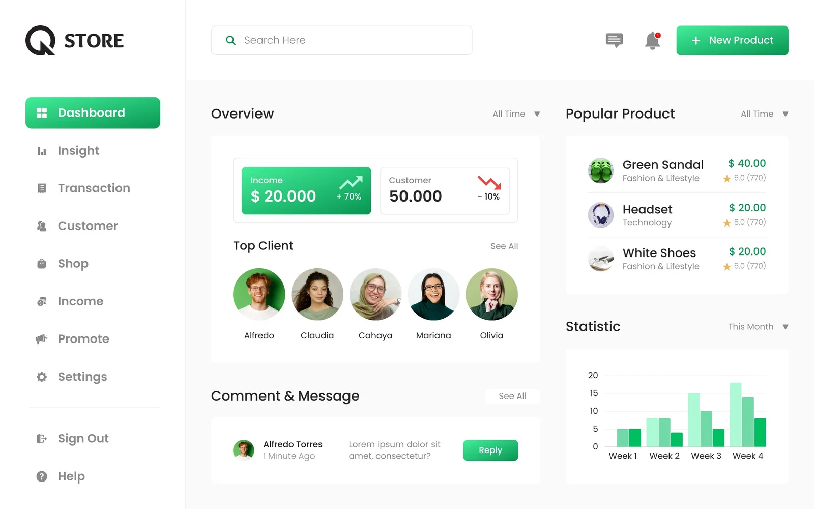

# Vertrical - Challenge

---

## 1. Specify test scenarios based on a prototype

Test scenarios created based on the prototype below.

### Test Scenarios

1. Search input:
    * Test case 001: Enter a valid search query in the search input field and verify that the results are displayed correctly.
    * Test case 002: Enter a invalid search query in the search input field and verify that the has no result.

2. Icon message:
    * Test case 003: Verify that the icon message is displayed correctly on the dashboard.
    * Test case 004: Verify that the icon message is clickable on the dashboard.
    * Test case 005: Verify that the icon message is displayed correctly on the dashboard.

3. Notification bell icon:
    * Test case 006: Verify that the notification bell icon is displayed correctly on the dashboard.
    * Test case 007: Verify that the notification bell icon is displayed correctly on the dashboard when has no new notification.
    * Test case 008: Verify that the notification bell icon displays the feedback of new notifications.

4. New product button:
    * Test case 009: Click on the new product button and verify that the modal/form is displayed.
    * Test case 010: Click on the new product button and verify the form works correctly.
    * Test case 011: Click on the new product button and verify that the cancel button works correctly.
    * Test case 012: Click on the new product button and verify that the save button works correctly.

5. Overview income increase/decrease section:
    * Test case 013: Verify that the overview income increase icon is displayed correctly and that it displays the correct data.
    * Test case 014: Verify that the overview income decrease icon is displayed correctly and that it displays the correct data.
    * Test case 015: Verify that the overview income value is displayed correctly.
    * Test case 016: Verify that the overview income percent value is displayed correctly.
    * Test case 017: Verify that the overview income button is clickable and verify that the user is redirected to the correct Income page.

6. Overview customer increase/decrease section:
    * Test case 018: Verify that the overview customer increase icon is displayed correctly and that it displays the correct data.
    * Test case 019: Verify that the overview customer decrease icon is displayed correctly and that it displays the correct data.
    * Test case 020: Verify that the overview customer value is displayed correctly.
    * Test case 021: Verify that the overview customer percent value is displayed correctly.
    * Test case 022: Verify that the overview customer button is clickable and verify that the user is redirected to the correct Income page.

7. Top Client section:
    * Test case 023: Verify that the Top Client section is displayed correctly and that it displays the correct data.
    * Test case 024: Verify that the Top Client See All button works correctly.
    * Test case 025: Verify that the Top Client item is clickable and verify that the user is redirected to the correct Client page.

8. Popular Product section:
    * Test case 026: Verify that the Popular Product filter by All Time works correctly and that it displays the correct data.
    * Test case 027: Verify that the Popular Product filter by Today works correctly and that it displays the correct data.
    * Test case 028: Verify that the Popular Product filter by This Week works correctly and that it displays the correct data.
    * Test case 029: Verify that the Popular Product filter by This Month works correctly and that it displays the correct data.
    * Test case 030: Verify that the Popular Product filter by This Year works correctly and that it displays the correct data.
    * Test case 031: Verify that the Popular Product filter by Custom Date Range works correctly and that it displays the correct data.
    * Test case 032: Verify that the Popular Product item is clickable and verify that the user is redirected to the correct Product page.

9. Statistic section:
    * Test case 033: Verify that the statistic filter by This Week works correctly and that it displays the correct data.
    * Test case 034: Verify that the statistic filter by This Month works correctly and that it displays the correct data.
    * Test case 035: Verify that the statistic filter by This Year works correctly and that it displays the correct data.
    * Test case 036: Verify that the statistic filter by Custom Date Range works correctly and that it displays the correct data.

10. Comment and Message section:
    * Test case 037: Verify that the Comment and Message section is displayed correctly and that it displays the correct data.
    * Test case 038: Click on the Reply button in the Comment and Message section and verify that the modal/form is displayed correctly.
    * Test case 039: Click on the Reply button in the Comment and Message section and verify that the modal/form is displayed correctly.
    * Test case 040: Click on the See All button in the Comment and Message section and verify that all data is displayed correctly.
    * Test case 041: Verify that the Comment and Message section is ordered by created_date.

11. Sidebar section:
    * Test case 042: Verify that the Dashboard button is displayed correctly and verify that the user is redirected to the Dashboard page.
    * Test case 043: Verify that the Insight button is displayed correctly and verify that the user is redirected to the Insight page.
    * Test case 044: Verify that the Transaction button is displayed correctly and verify that the user is redirected to the Transaction page.
    * Test case 045: Verify that the Customer button is displayed correctly and verify that the user is redirected to the Customer page.
    * Test case 046: Verify that the Shop button is displayed correctly and verify that the user is redirected to the Shop page.
    * Test case 047: Verify that the Income button is displayed correctly and verify that the user is redirected to the Income page.
    * Test case 048: Verify that the Promote button is displayed correctly and verify that the user is redirected to the Promote page.
    * Test case 049: Verify that the Settings button is displayed correctly and verify that the user is redirected to the Settings page.
    * Test case 050: Verify that the Sign Out button is displayed correctly and verify that the user is redirected to the Sign Out page.
    * Test case 051: Verify that the Help button is displayed correctly and verify that the user is redirected to the Help page.

12. Routes verification:
    * Test case 052: Verify user not logged not access the Dashboard page by enter Dashboard URL.
    * Test case 053: Verify user not logged not access the Insight page by enter Insight URL.
    * Test case 054: Verify user not logged not access the Transaction page by enter Transaction URL.
    * Test case 055: Verify user not logged not access the Customer page by enter Customer URL.
    * Test case 056: Verify user not logged not access the Shop page by enter Shop URL.
    * Test case 057: Verify user not logged not access the Income page by enter Income URL.
    * Test case 058: Verify user not logged not access the Promote page by enter Promote URL.
    * Test case 059: Verify user not logged not access the Settings page by enter Settings URL.
    * Test case 060: Verify user not logged not access the Sign Out page by enter Sign Out URL.
    * Test case 061: Verify user not logged not access the Help page by enter Help URL.
